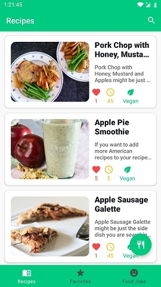

## MyRecipes (ru)

___Kotlin  -  MVVM  -  Clean Architecture  -  Jetpack Navigation component (Bottom navigation bar, safe args) -  DI Hilt___   
___Room Database - Retrofit + OkHttp + GSON -  Kotlin Coroutines  -  Kotlin Flow   -  View Binding  -  Glide  -  RecyclerView___

>MyRecipes – это простое и удобное приложение для поиска рецептов, в котором вы найдете вдохновение для вашего следующего приема пищи. 

В приложении легко найти рецепт, который вам понравится. Находишь ингредиенты, которые есть у тебя в холодильнике, отмечаешь их в поиске и приложение показывает,что из имеющихся ингредиентов ты можешь приготовить. Если вы страдаете от пищевой аллергии или у вас есть какие-то особые диетические требования, MyRecipes может отфильтровать рецепты, содержащие ингредиенты, которых вы хотите избежать. Это особенно полезно, если вы искали вегетарианское или веганское блюдо, чтобы помочь вам спланировать свое питание.

  
