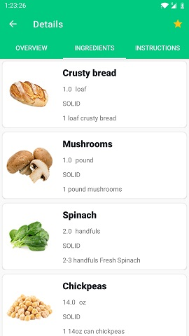
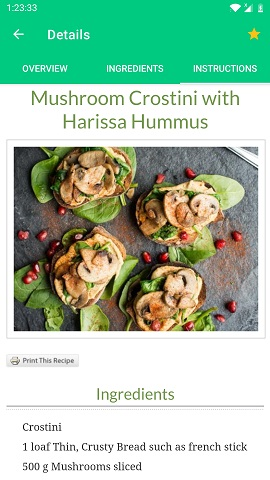

## MyRecipes (en)

___Kotlin  -  MVVM  -  Clean Architecture  -  Jetpack Navigation component (Bottom navigation bar, safe args) -  DI Hilt___   
___Room Database - Retrofit + OkHttp + GSON -  Kotlin Coroutines  -  Kotlin Flow   -  View Binding  -  Glide  -  RecyclerView___

MyRecipes is a simple and easy-to-use recipe search app that will give you inspiration for your next meal. 

The app makes it easy to find a recipe you like. You find the ingredients you have in your refrigerator, mark them in the search and the app shows you what you can make with the available ingredients. If you suffer from food allergies or have any special dietary requirements, MyRecipes can filter out recipes that contain ingredients you want to avoid. This is especially helpful if you were looking for a vegetarian or vegan dish, for example.

  

Each recipe has a description, ingredient list, and cooking instructions.

  

If you like a recipe, you can add it to your favorites by clicking on the star. In the favorites you can select recipes with a long click and delete or delete them all at once.

  

In the "Food Joke" menu you will see a food joke that you can share with your friends.

  

## MyRecipes (ru)

___Kotlin  -  MVVM  -  Clean Architecture  -  Jetpack Navigation component (Bottom navigation bar, safe args) -  DI Hilt___   
___Room Database - Retrofit + OkHttp + GSON -  Kotlin Coroutines  -  Kotlin Flow   -  View Binding  -  Glide  -  RecyclerView___

MyRecipes – это простое и удобное приложение для поиска рецептов, в котором вы найдете вдохновение для вашего следующего приема пищи. 

В приложении можно легко найти рецепт, который вам понравится. Находишь ингредиенты, которые есть у тебя в холодильнике, отмечаешь их в поиске и приложение показывает, что из имеющихся ингредиентов ты можешь приготовить. Если вы страдаете от пищевой аллергии или у вас есть какие-то особые диетические требования, MyRecipes может отфильтровать рецепты, содержащие ингредиенты, которых вы хотите избежать. Это особенно полезно, если вы искали вегетарианское или веганское блюдо, например.

  

В каждом рецепте есть описание, список ингредиентов, инструкция приготовления.

  

Если вам понравился рецепт, вы можете добавить его в избранные, нажав на звездочку. В избранных можно выделить рецепты долгим кликом и удалить или сразу удалить все.

  

В меню «Food Joke» вы увидите шутку о еде, которой можно поделиться с друзьями.

 
